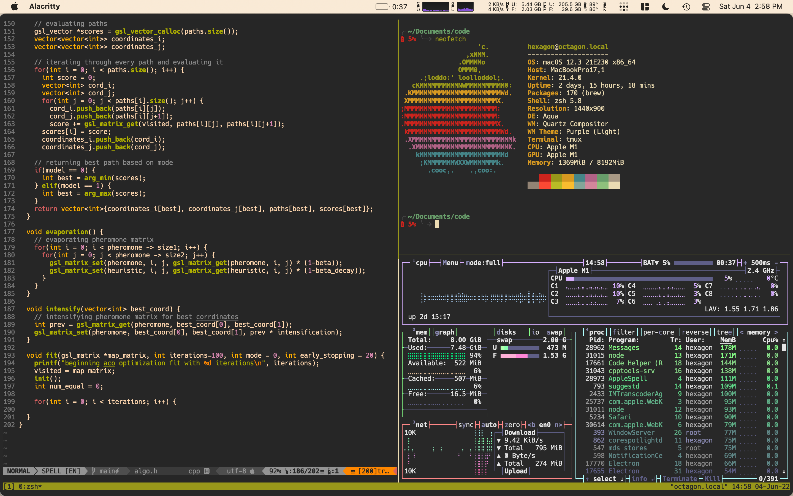
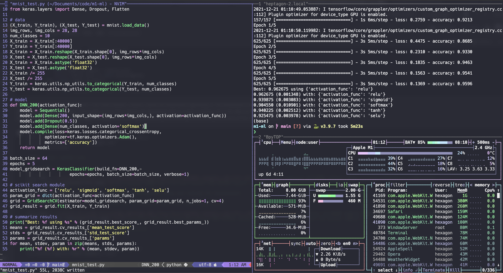

# my dotfiles

```sh
git clone https://github.com/h3x4g0ns/dotfiles.git
cd dotfiles && bash install.sh
grep -qxF 'source ~/.custom.sh' ~/.zshrc || echo 'source ~/.custom.sh' >> ~/.zshrc
grep -qxF 'source ~/.history.sh' ~/.zshrc || echo 'source ~/.history.sh' >> ~/.zshrc
source ~/.zshrc
```

The installer supports Ubuntu/Debian and macOS. macOS uses Homebrew, including the Alacritty cask. Docker Desktop is installed when Docker is missing and must be launched once.

## v2



## v1


